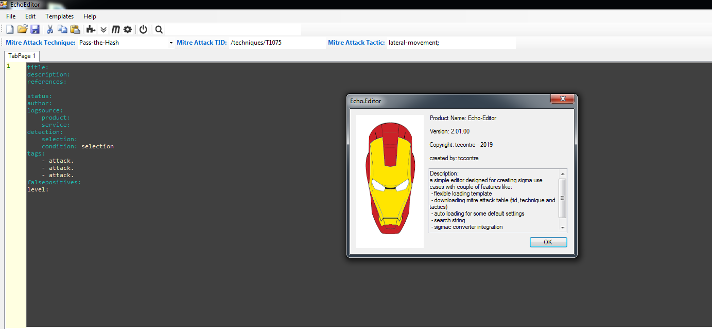
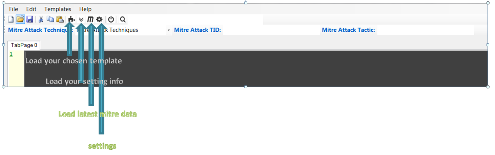

Echo-Editor
==============================
simple editor that has some automate features in developing sigma rules.

 </img>

installation:
==============================
1. create an output folder where the echo-editor exe located and declare it in the setting window.
2. create mitre folder where the downloaded raw mitre web paged and cooked data will be placed.
3. template folder for your sigma format templates. (it may not support every format but it locate some field that we ussually modify and used)
4. folder where sigmac converter of Florian Roth will be place.
5. update the setting form for folder path and some naming format.
    note: 
     - <tid> : string will be translated in the code as the tid value of the mitre attack you have chosen.
     - <technique> : string will be translated in the code as the technique value of the mitre attack you have chosen.
  
  
Features:
==============================
1. flexible in loading templates
2. downloading mitre attack table (tid, technique and tactics)
3. auto loading of you default setting for filling up some known fields like name, mitre id and etc.
4. simple color coding (not perfect)
5. line number (need to improve)
6. sigmac converter integration
7. search string functions (pressing 'esc' key to remove highlight)

 </img>

#simple template loading.

  

